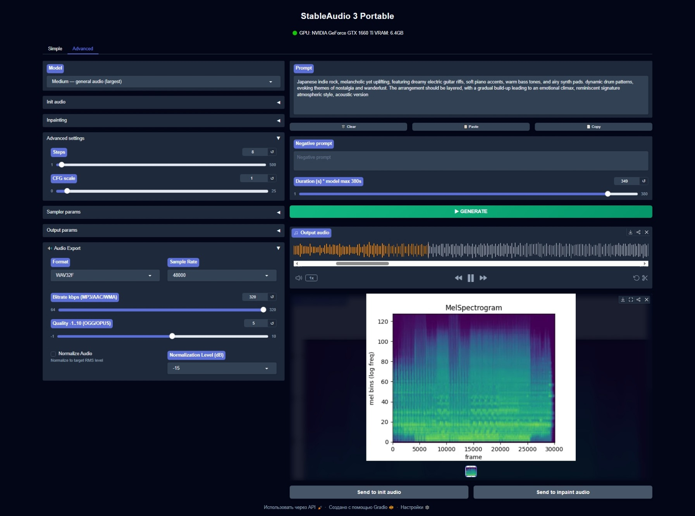

# 🚀 StableAudio3: Stable Audio 3 Portable webUI interface

## 🔧 About
Stable Audio 3 is the next generation of Stable Audio: a focused, streamlined platform for inference and fine-tuning.

## 🔧 Models

| Model | Model ID | Autoencoder | Hardware | Params | Max length | Use case |
|---|---|---|---|---|---|---|
| [**Stable Audio 3 Small-Music**](https://huggingface.co/LeeAeron/stable-audio-3-small-music) | `small-music` | SAME-Small | CPU | 433M | 120s | Lightweight music-only inference, no GPU required |
| [**Stable Audio 3 Small-SFX**](https://huggingface.co/LeeAeron/stable-audio-3-small-sfx) | `small-sfx` | SAME-Small | CPU | 433M | 120s | Lightweight sound effects-only inference, no GPU required |
| [**Stable Audio 3 Medium**](https://huggingface.co/LeeAeron/stable-audio-3-medium) | `medium` | SAME-Large | GPU (CUDA) | 1.4B | 380s | High Quality, Fast Inference |

## 🔧 Key Differences from Official StableAudio3
- Main `.bat` menu with option to install/reinstall project
- Fully portable with offline StableAudio3 and T5 Gemma models
- Rewriten and optimized code for beter work

## ⚙️ Installation
StableAudio3 uses Python 3.11 and Torch 2.10.0 Cuda 13.0.

StableAudio3 supports GTX and RTX cards, including GTX16xx and RTX 20xx–50xx, even with 6Gb VRAM (with auto offload mode).

### 🖥️ Windows Installation

This project provided with only *.bat installer/re-installer/starter/updater file, that will download and install all components and build fully portable StableAudio3.

➤ Please Note:
    - I'm supporting only nVidia GTX16xx and RTX20xx-50xx GPUs.
    - This installer is intended for those running Windows 10 or higher. 
    - Application functionality for systems running Windows 7 or lower is not guaranteed.

- Download the StableAudio3 .bat installer for Windows in [Releases](https://github.com/LeeAeron/StableAudio3/releases).
- Place the BAT-file in any folder in the root of any partition with a short Latin name without spaces or special characters and run it.
- Select INSTALL (2) entry .bat file will download, unpack and configure all needed environment including FlashAttention.
- After installing, select START (1). .bat will loads StableAudio3 models (own modded config) and T5 Gemma model for offload usage.

## ⚙️ New Features:
- auto-download models at first start
- support for change output file format: wav/mp3/aac/m4a/m4b/ogg/flac/opus changeable audio files (with own local FFMPEG in StableAudio3 folder)
- auto-saving synthezed output file into local 'outputs' folder (in project folder)
- additional Copy/Paste/Clear buttons for 'prompt' (works with clipboard)
- output audio settings: samplerate, bitrate (for lossy formats) or qualilty (for ogg/opus formats)
- normalization with dB level setting
- auto-detecting GPU and enabling or disabling FlashAttention acceleration
- auto-saving settings into local folder for future using

## 📺 Credits

* [LeeAeron](https://github.com/LeeAeron) — additional code, modding, reworking, repository, Hugginface space, features, installer/launcher.
* [Stability-AI](https://github.com/Stability-AI) - native code, models

## 📝 License

The **StableAudio3** code is released under Stability AI Community License.
